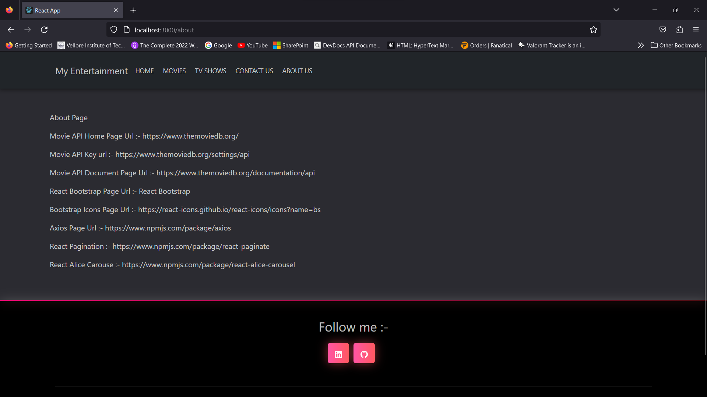

# Movie App 🎬🍿

Welcome to **Movie App**, your ultimate destination for exploring the fascinating world of movies! 🌟


Dive into an immersive cinematic experience like never before. With **Movie App**, you can effortlessly access movie details and information through a powerful API, all while enjoying the sleek and intuitive interface of our React-based application.

## Table of Contents

* [About the Project](#🚀Getting-Started)
    * [Features](#features)
    * [Built With](#built-with)
* [Working Demo](#working-demo)
* [Installation](#installation)
* [Usage](#usage)
* [Roadmap](#roadmap)
* [Contributing](#contributing)
* [License](#license)
* [Contact](#contact)


### 🚀Getting-Started

**Movie App** is a React application that allows users to search for movies, view detailed information about them, and save their favorites for later. 

### Features

* **Search** for movies by title
* **View** detailed information about movies
* **Save** your favorite movies
* **Explore** recommended movies
* **Browse** the top movies of all time

### Built With

* [React](https://reactjs.org/)
* [The Movie Database API](https://www.themoviedb.org/documentation/api)
* [Material UI](https://material-ui.com/)
* [React Router](https://reactrouter.com/)
* [React Icons](https://react-icons.github.io/react-icons/)
* [React Slick](https://react-slick.neostack.com/)
* [React Scroll](https://www.npmjs.com/package/react-scroll)
* [React Toastify](https://fkhadra.github.io/react-toastify/introduction)

## Working Demo

### Home Page


### Movie Details Page


### Tv Show Page


### Contact Page


### About Page


## Installation

To get a local copy up and running, follow these steps.

### Prerequisites

* npm
  ```
  npm install npm@latest -g 

  ```

### Installation

1. Clone the repo
   ```
   git clone 
    ```
2. Install NPM packages
    ```
    npm install
    ```
3. Start the application
    ```
    npm start
    ```
4. Enjoy! 🎉

## Usage

**Movie App** is a React application that allows users to search for movies, view detailed information about them, and save their favorites for later.

## Roadmap

See the [open issues](

## Contributing

Contributions are what make the open source community such an amazing place to be learn, inspire, and create. Any contributions you make are **greatly appreciated**.

1. Fork the Project

2. Create your Feature Branch (`git checkout -b feature/AmazingFeature`)

3. Commit your Changes (`git commit -m 'Add some AmazingFeature'`)

4. Push to the Branch (`git push origin feature/AmazingFeature`)
5. Open a Pull Request

## License

Distributed under the MIT License. See `LICENSE` for more information.

## Contact

* [LinkedIn](https://www.linkedin.com/in/Ayushpal11)
* [Email](mailto:ayushpal74553@gmail.com)

